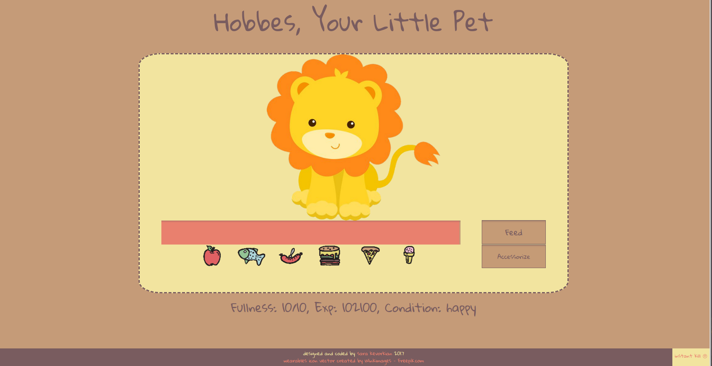
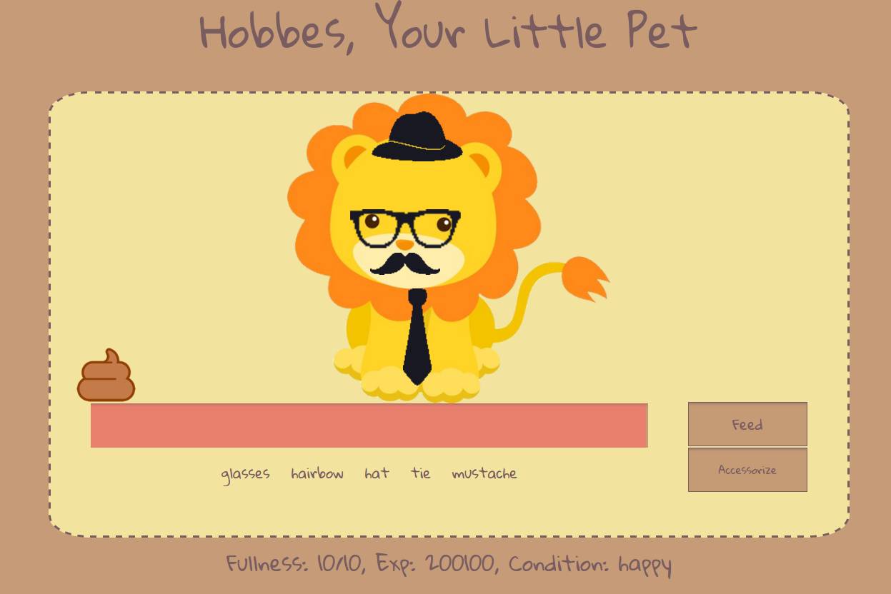
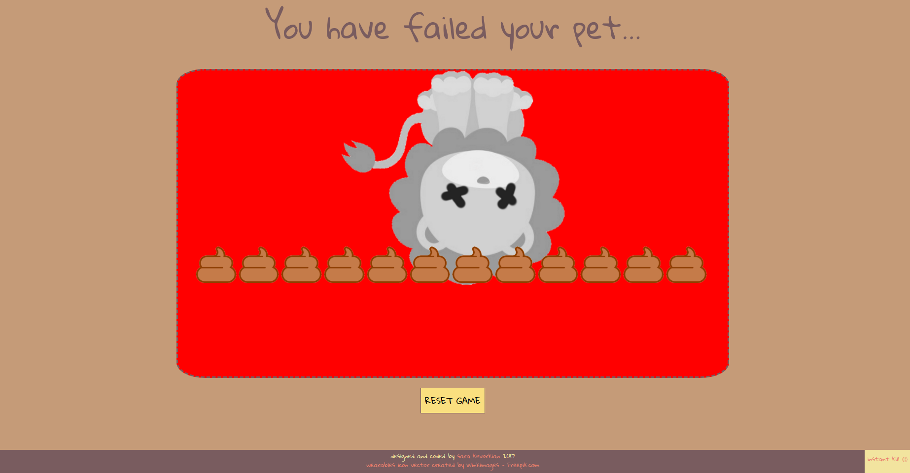

<h1>Browsergotchi! Now you can have your own tamagotchi right in your browser!</h1>

<h2>Technologies used.</h2>

    1) HTML
    2) CSS
    3) JavaScript
    4) JQuery
    5) GIMP to edit images
    6) free icons courtesy of Winkimages by Freepik.com (wearables) and http://goodstuffnononsense.com/hand-drawn-icons/cooking-icons/ (foods)
    7) color pallette from coolors.com

<h2>Your process/approach.</h2>
    1) first I drew out wireframes and then recreated the display in HTML/CSS.
    2) then I pseudocoded the basic hunger and feeding system (MVP).
    3) then I created functions that dealt with the data behind that system.
    4) after debugging and ensuring the data worked, I linked it up to the display elements.
    5) After getting that system working. I went through and cleaned up my code/comments to make DRY and more organized.
    6) then I repeated steps 2-5 for each element I wanted to add into the game.

<h2>Unsolved problems.</h2>
    1) I initially wanted the hunger meter to be vertical instead of horizontal, but was having a hard time lining up the elements, since I would have had to use transform: rotate(90deg) in CSS, but the html element would still be represented horizontally. I decided to go with a horizontal meter in the interest of time.
    2) The wearables don't line up consistently across different screen sizes.
    3) I was having a hard time getting the message when you haven't unlocked any accessories to go away after re-clicking on accesorize.
    4) when saving the pet to localStorage, the wearables lose their class of "Wearable" and become simple objects upon retrival. This messes with the add and remove wearables function. I was unable to figure out how to save the class along with the object, so I decided to reinitialize the wornItems array with each page load. the unlocked wearables are still unlocked as the pet's experience points save between page loads.

<h2>Your biggest wins and challenges.</h2>

    1) THIS WHOLE THING was a win. the main three elements I wanted (food, poop, and experience) I was able to do, and a bonus for myself (wearables) I was also able to get started, even if it isn't quite perfect.
    2) My friend found a bug that wouldn't let her get past the naming screen, even when she did submit a name. I tested a bunch of things but couldn't recreate it on my computer. Later I found the issue was that if you had viewed the page multiple times but hadn't yet created a pet, the pet object was still being stored. On retrevial its value was "undefined" so it was causing problems. I added logic such that the pet is only retrieved if there is a pet to retrieve.
    3) another challenge was that I added a data attribute to both food and accessories menu to correlate the clicked item with the food/wearable stored in an array. It was named the same for both sets but I also had a displayUnlocked function that both could be passed into, so if say 3 foods were unlocked but only 1 wearable was unlocked all 3 wearables would be unlocked because of the array indexing. I was able to fix it after much debugging by passing in the name of the menu for more specific jQuery selection.
    4) one thing that helped me a lot was to give different classes of "newgame", "gameplay", and "endgame" which made it easy to toggle the elements on and off as the game progressed without having to select EACH SINGLE ELEMENT in jQuery.

<h2>Screenshots</h2>

